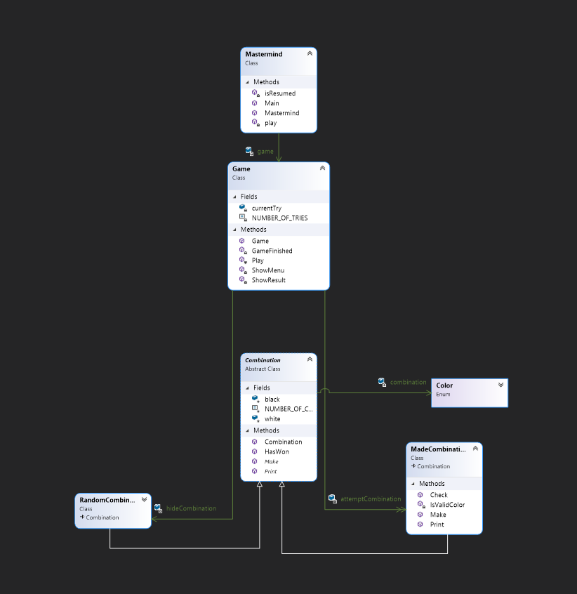

# Mastermind Poo

---

### Table of Contents

- [Description](#description)
- [How To Use](#how-to-use)
- [Author Info](#author-info)

---

## Description

A simple mastermind game. Console application made while following the [POO course](https://escuela.it/cursos/programacion-orientada-a-objetos/estudiar) from  [Escuela it](https://escuela.it/).

#### Technologies

- .NET

---

## How To Use

Clone the repo, build the solution and you are ready to go.

---

## References
[Back To The Top](#read-me-template)

[POO course](https://escuela.it/cursos/programacion-orientada-a-objetos/estudiar) from  [Escuela it](https://escuela.it/).

---

## Author Info

- Linkedin - [Federico Andrés Jácome Castañeda](https://www.linkedin.com/in/federicojacome/)
- Website - [Portfolio](https://federocky.github.io/PersonalWeb/)

[Back To The Top](#read-me-template)
